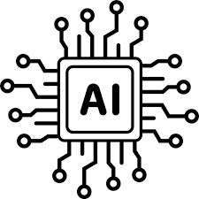

## I. Introduction

Artificial intelligence has emerged as a transformative force in various fields. Within the domain of Software Engineering, the integration of AI tools has become increasingly relevant, offering solutions that streamline development processes, improve code quality, and aid in the creation of more efficient and effective software. Specifically, I have utilized ChatGPT and Co-Pilot in ICS 314 to answer queries, generate code snippets, and assist with coding tasks.

## II. Personal Experience with AI

1. Experience WODs: While I seldom relied on AI for experience WODs due to the comprehensive guidance provided in the instructional videos, there was one instance in E18 where Co-Pilot proved instrumental in generating Underscore functions.
2. In-class Practice WODs: The in-class practice WODs didn't necessitate the use of AI as the experience WODs provided ample references for me. 
3. In-class WODs: Co-Pilot emerged as a valuable tool, especially in the earlier and simpler in-class WODs. As an example, Co-Pilot auto generated a CSS class prefilled with several attributes during one of the WODs.
4. Essays: I employed ChatGPT as a grammar-checking and proofreading tool. Its assistance in refining my written content contributed to the overall polish and coherence of my essays.
5. Final project:  Although I attempted to leverage ChatGPT for programming guidance in the final project, its utility proved limited in addressing specific programming challenges. The intricate nature of the project required a more hands-on and nuanced approach.
6. Learning a concept / tutorial: My preferred method for learning new concepts or following tutorials did not involve AI. I leaned towards using Google for concept exploration.
7. Answering a question in class or in Discord: When faced with questions beyond my immediate knowledge, I turned to ChatGPT for initial insights. While it served as a valuable starting point, I recognized the need for further exploration and verification to fully address complex inquiries.
8. Asking or answering a smart-question: ChatGPT played a role in refining questions, assisting in the process of rephrasing to enhance clarity.
9. Coding example e.g. “give an example of using Underscore .pluck”: I consulted ChatGPT to generate multiple coding examples, particularly when seeking a deeper understanding of specific functions. Its ability to produce diverse examples when asked "provide several examples of using the map function in Underscore" proved to be useful.
10. Explaining code: ChatGPT emerged as a proficient tool in explaining code. Its adeptness in understanding and articulating code facilitated effective communication of programming logic.
11. Writing code: Co-Pilot found its place in my toolkit for crafting relatively simple pieces of code. The tool's quick generation of code and minimal error rate made it a convenient choice for expediting the earlier and easier coding tasks such as those for plain HTML/CSS.
12. Documenting code: Leveraging ChatGPT for code documentation, I would input my code and instruct the AI to generate comments. Following this, a manual review was undertaken to refine and polish the generated documentation as needed.
13. Quality assurance: While I experimented with ChatGPT for quality assurance tasks, it demonstrated limitations in accurately identifying ESLint errors and providing reliable advice. Manual verification remained essential for ensuring code quality.
14. Other uses in ICS 314 not listed: In moments of challenge or uncertainty, the combined use of ChatGPT and Google proved beneficial to my learning.

## III. Impact on Learning and Understanding
The integration of AI, notably tools like ChatGPT and Co-Pilot, has markedly enhanced my learning experience in software engineering. AI's immediate accessibility to explanations, code snippets, and suggestions has enriched my comprehension, particularly in grasping intricate coding syntax and complex concepts.

However, challenges emerge, urging caution against over-reliance. AI-generated solutions, while expedient, require validation to align with specific requirements. The collaborative process of refining these solutions has honed my critical thinking and problem-solving skills. Overall, the incorporation of AI has brought valuable supplementary support, broadening my perspective and reinforcing adaptability in navigating diverse coding challenges within the realm of software engineering.

## IV. Practical Applications
Beyond ICS 314, AI has found extensive practical applications in real-world software engineering projects. For instance, AI-driven code generation tools like GitHub Copilot are employed to streamline coding processes, enhancing productivity and reducing development time.

## V. Challenges and Opportunities
In the course, challenges arose in relying solely on AI for problem-solving, as AI-generated solutions sometimes lacked contextual precision. Co-Pilot, while beneficial, occasionally produced code snippets that needed careful validation.

Despite challenges, AI presents significant opportunities for deeper integration in software engineering education. Augmenting coding exercises with AI-driven instant feedback could enhance the learning experience. Additionally, personalized AI-assisted learning paths, tailored to individual student needs, could provide targeted support for skill development.

## VI. Comparative Analysis
Traditional teaching methods in software engineering often rely on lectures and hands-on assignments. While effective, they may lack individualized support. AI-enhanced approaches offer instant feedback, accelerating practical skill development. While AI boosts engagement and provides quick feedback, traditional methods remain crucial for cultivating a deep understanding and facilitating collaborative learning. A blended approach, integrating the strengths of both, holds promise for comprehensive software engineering education.

## VII. Future Considerations
The future role of AI in software engineering education appears promising. AI could evolve to offer more personalized learning experiences, tailoring content to individual student needs. As tools like Co-Pilot advance, they may provide increasingly sophisticated guidance, aiding in code generation and problem-solving. However, challenges such as maintaining the human-centric aspects of teaching, ensuring ethical AI use, and addressing biases in AI-generated content need careful consideration.

## VIII. Conclusion
The integration of AI in the Software Engineering course has been transformative, offering valuable support in comprehension, skill development, and problem-solving. While AI tools like Co-Pilot expedited coding processes, challenges surfaced in contextual accuracy. AI's immediate accessibility proved beneficial, yet a balanced approach that incorporates traditional learning methods is essential for a comprehensive understanding. Future optimization could involve refining AI tools to better understand context and provide more accurate feedback. 
