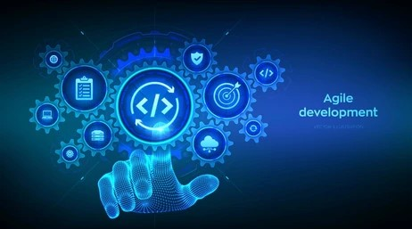

Software engineering is a multidisciplinary field that involves the systematic design, development, testing, and maintenance of software systems. It encompasses a structured and methodical approach to problem-solving, emphasizing the creation of reliable, efficient, and scalable solutions to address diverse challenges. Software engineers apply engineering principles to develop software that meets specific requirements, considering aspects such as functionality, performance, security, and user experience.

## Open Source Software Development

Open Source Software Development is a collaborative approach where the source code of a software project is made available to the public, allowing anyone to view, use, modify, and distribute it. Beyond web applications, this model fosters innovation and collaboration in fields such as scientific research, data analysis, and embedded systems development. The transparency and community-driven nature of open source practices can be applied to projects in any domain, enhancing knowledge sharing and accelerating progress.

## Functional Programming

Functional Programming is a paradigm that treats computation as the evaluation of mathematical functions, avoiding changing-state and mutable data. This concept is not limited to web applications but can be advantageous in various domains, including scientific simulations, financial modeling, and artificial intelligence. Its emphasis on immutability and pure functions can lead to more robust and maintainable code, ensuring predictability and reliability in diverse applications.

## Agile Project Management

Agile Project Management is a flexible and iterative approach that prioritizes adaptability, collaboration, and customer feedback. One specific style within Agile, Issue Driven Project Management, focuses on addressing specific issues or tasks in a project incrementally. This methodology is not exclusive to web applications and can be applied to a wide range of projects, such as hardware development, infrastructure projects, or research initiatives. Its iterative nature ensures that adjustments can be made based on real-time feedback, promoting efficiency and customer satisfaction.
