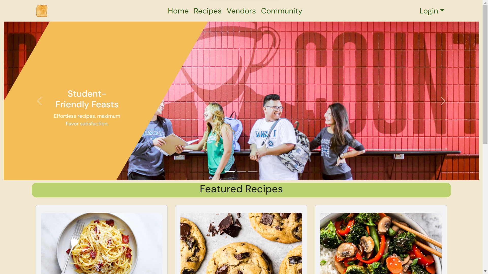
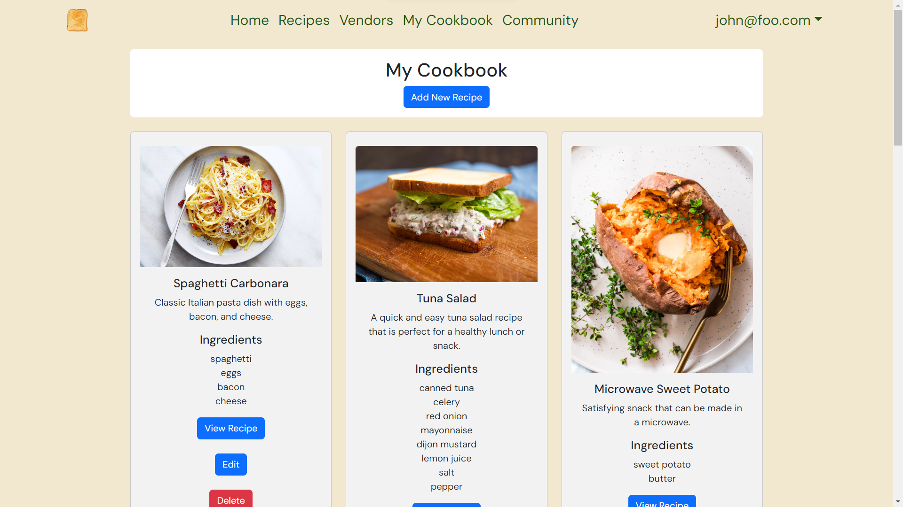
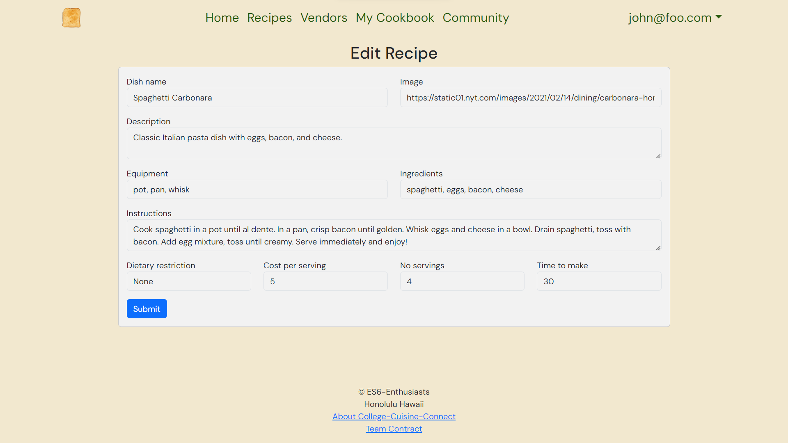

## Overview

College Cuisine Connect is a project designed to help college students with limited cooking skills and resources discover nutritious and budget-friendly recipes. The platform builds a sense of community by letting students share their culinary tips and experiences with one another. It serves as a centralized hub offering a diverse range of recipes tailored to the specific constraints of college life, including limited kitchen access and time constraints.

The user-friendly interface allows students to explore quick and easy recipes, from microwave-based meals to those requiring minimal cooking equipment. The platform considers dietary preferences, allergies, and restrictions to ensure inclusivity within the UH community. College Cuisine Connect aims to provide a curated collection of college lifestyle recipes, encourage healthy eating habits, and establish a supportive community for recipe sharing.

## My Contributions

My primary focus revolved around enhancing the functionality of the My Cookbook page, a dedicated space for students to manage their created recipes. 

In particular, I took charge of developing the Add Recipe and Edit Recipe pages, allowing users to easily add, edit, and delete their culinary creations. I also refined the user interface for a more cohesive experience throughout the website. Moreover, I incorporated authentic recipes into the website to make the platform more practical and hopefully inspire others to share their favorite recipes.

## Lessons Learned

Working on this team project provided me with valuable insights into collaborative coding practices. Working within a group setting, I honed my collaborative coding skills by adhering to the principles of Issue Driven Project Management. This involved creating issues and branches on GitHub, allowing team members to work on designated parts without encountering conflicts.

I also expanded my knowledge of the Meteor framework, gaining hands-on experience with managing collections and learning how to effectively add and edit them. In Meteor, this meant building components that integrate smoothly into different pages. By using React and Bootstrap, I realized how these tools make it easier to style pages and create a more efficient, visually appealing development process.

---

Learn more about [College Cuisine Connect](https://es6-enthusiasts.github.io/CollegeCuisineConnect/).
