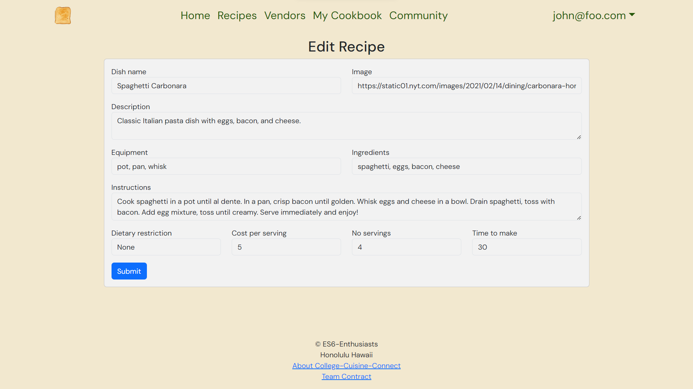

## Overview

College Cuisine Connect is a project designed to help college students with limited cooking skills and resources discover nutritious and budget-friendly recipes. The platform fosters a sense of community by facilitating the sharing of culinary experiences among students. It provides a centralized hub offering a diverse range of recipes tailored to the specific constraints of college life, including limited kitchen access and time constraints.

The user-friendly interface allows students to explore quick and easy recipes, from microwave-based meals to those requiring minimal cooking equipment. The platform considers dietary preferences, allergies, and restrictions to ensure inclusivity within the UH community. College Cuisine Connect aims to provide a curated collection of college lifestyle recipes, encourage healthy eating habits, and establish a supportive community for recipe sharing.

## My Contributions

My primary focus revolved around enhancing the functionality of the My Cookbook page, a dedicated space for students to manage their created recipes. 

In particular, I took charge of developing the Add Recipe and Edit Recipe pages, empowering users to seamlessly add, edit, and delete their culinary creations. Additionally, I refined the user interface for a more cohesive experience throughout the website. Moreover, I incorporated authentic recipes into the website, ensuring a practical platform for culinary exploration.

## Lessons Learned

Engaging in this collaborative endeavor provided me with valuable insights into collaborative coding practices. Working within a group setting, I honed my collaborative coding skills by adhering to the principles of Issue Driven Project Management. This involved creating issues and branches on GitHub, facilitating a streamlined workflow where team members could work on designated parts without encountering conflicts.

Moreover, I deepened my understanding of the Meteor framework, delving into the intricacies of managing collections—mastering the art of adding and editing collections. In the Meteor framework, the process involves crafting components that are seamlessly integrated into pages. Leveraging the power of React and Bootstrap, I discovered how these tools simplify the styling of pages, allowing for a more efficient and visually appealing development process.

---

Learn more about [College Cuisine Connect](https://es6-enthusiasts.github.io/CollegeCuisineConnect/) or explore the [application](https://collegecuisineconnect.site/) directly.
