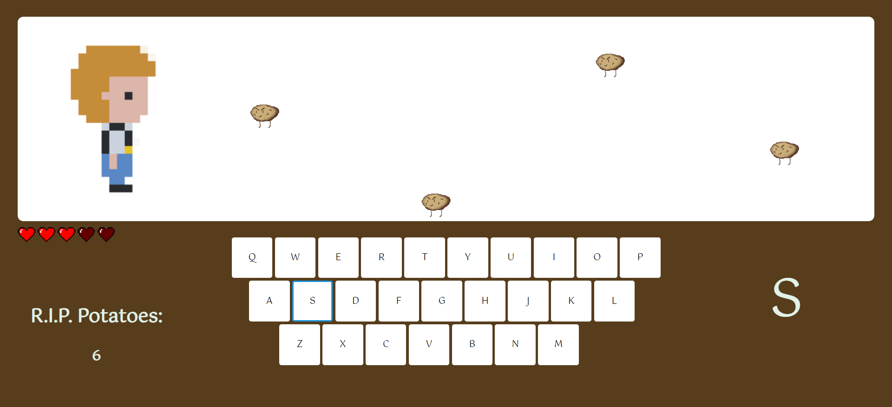

During my high school years, I learned Processing (p5.js) as part of my coursework. In one of our assignments, we developed a rudimentary side-scrolling game, an experience that inspired me to create my own game using the p5.js library. My motivation for starting this project was to provide my younger sibling a fun experience that also serves to enhance her typing skills.

This project includes a title screen that allows players to adjust difficulty levels and enable or disable power-up options. It also features background music, sound effects, and some custom artwork.

The gameplay involves facing off against a wave of potatoes that advance towards the player's character. To stop them, the player must swiftly type the correct key to destroy each potato before it reaches their character. Failing to input the correct key or allowing a potato to reach the character results in the loss of a life. If all lives are depleted, the player loses the game.

## Takeaways

Throughout this project, I learned how important it is to break down a project into smaller, manageable components. I also realized that careful planning helps prevent code conflicts down the road and keeps the workflow smooth. Additionally, I've come to appreciate the significance of code organization, realizing that starting with a well-structured approach is critical for project success.

View the full project on my [GitHub](https://github.com/loellelam/Potato-Prevent) or [play now](https://loellelam.github.io/Potato-Prevent/)!

Disclaimer: Compatibility may vary across devices and browsers. This project has been tested and verified to work on the Google Chrome browser running on Windows 10/11.
